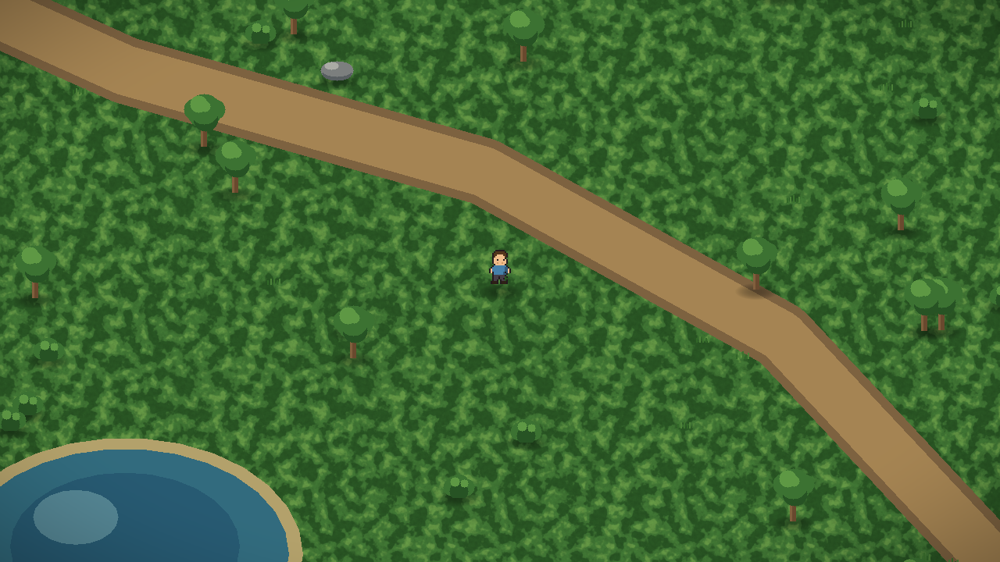
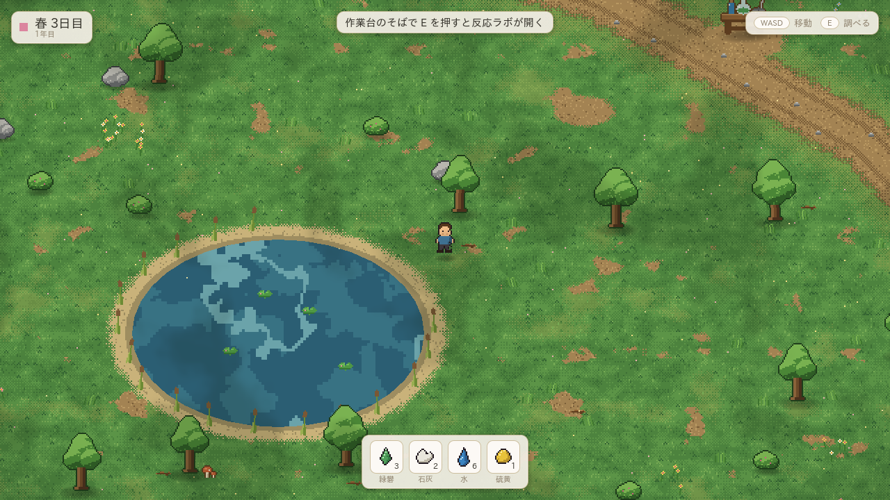
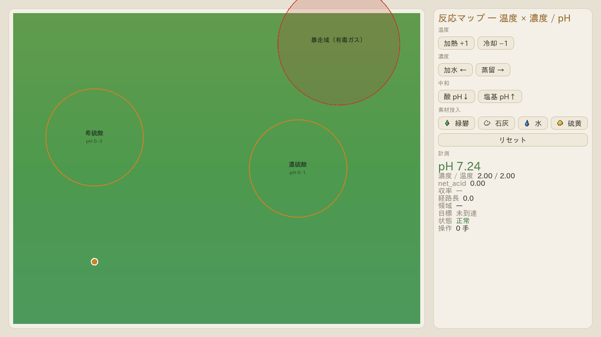
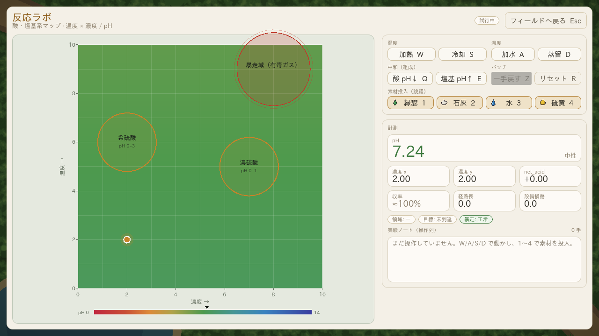

# Field & Flask（仮題）

> 採取・精製・創造に特化した科学クラフトゲーム
> **石器時代同然の世界で、素材を探して集め、化学の力で文明の道具を一つずつ取り戻していく。**

- マップ・採取の手触り: Stardew Valley
- クラフト・調合の手触り: Potion Craft
- 技術の積み上げ方: 目標から逆算する技術ツリー
- エンジン: **Godot 4.7**

詳しいコンセプトは [`docs/design/concept-v2.md`](docs/design/concept-v2.md) を参照。

---

## プロジェクト構成

設計原則は「**ロジックとエンジンの分離**」（設計書 §8）。

```
core/            ← 副作用なし・エンジン非依存の純粋ロジック
  materials/       素材定義・純度計算
  reactions/       反応マップ・領域・シミュレータ
  calendar/        季節・カレンダー
  __tests__/       ヘッドレステスト
presentation/    ← エンジン依存（描画・UI）。core を呼ぶだけ
data/            ← データ駆動の .tres（素材・反応マップの実データ）
  materials/
  reactions/
docs/design/     ← 設計ドキュメント
```

`core/` は Node に依存しない（`RefCounted` / `Resource` のみ）。
「純度72%の硫酸で反応Xは成立するか」を **UIを起動せず** 検証できることが、
数十時間規模のバランス調整では決定的な差になる。

## セットアップ

1. [Godot 4.7](https://godotengine.org/) を入手する（MIT・完全無料）。
2. このリポジトリを Godot エディタで「インポート」する（`project.godot` を選択）。
3. F5 で採取マップ（`presentation/field/field.tscn`）が起動し、キャラクターを操作できる。
   作業台（フラスコの載った机）のそばで **E** を押すと反応ラボが開く。

### 操作

| 場面 | キー | 動作 |
|---|---|---|
| フィールド | W / A / S / D または 矢印キー | 移動（8方向） |
| フィールド | E | 作業台を調べる（反応ラボを開く） |
| 反応ラボ | W / S | 加熱 / 冷却 |
| 反応ラボ | A / D | 加水 / 蒸留 |
| 反応ラボ | Q / E | 酸 / 塩基を加える（中和） |
| 反応ラボ | 1〜4 | 素材投入（緑礬・石灰・水・硫黄） |
| 反応ラボ | Z / R | 一手戻す / リセット |
| 反応ラボ | Esc | フィールドへ戻る |

反応ラボは単体でも動く（`presentation/reaction/reaction_lab.tscn` を F6）。
`presentation/main.tscn` は core ロジックのヘッドレスデモ（別シーン）。

### 画面（仮UI）

| フィールド + HUD（作業台の広場） | 池のほとり | 反応ラボ | フィールドから開いたラボ |
|---|---|---|---|
|  |  |  |  |

地形タイルとスプライトの一覧: [`docs/prototypes/tiles-preview.png`](docs/prototypes/tiles-preview.png) /
[`docs/prototypes/sprites-preview.png`](docs/prototypes/sprites-preview.png)

スクリーンショットは `tools/screenshot.gd` で撮れる（Xvfb + `gl_compatibility`。`SHOT_ACTION=open_lab` でラボを開いた状態も撮れる）。

## ブラウザで動かす（Web エクスポート）

Godot の Web エクスポート（WebAssembly）で、インストール無しにブラウザで動かせる。
`export_presets.cfg` の Web プリセットは **Thread Support を切ってある** ので、
COOP/COEP ヘッダを付けられない GitHub Pages や素朴な静的サーバでも動く。

- **GitHub Pages（自動）**: `.github/workflows/web.yml` が push のたびにエクスポートして公開する。
  初回だけリポジトリの Settings → Pages → Source を **GitHub Actions** にする。
  公開 URL は `https://<owner>.github.io/<repo>/`。どのブランチの実行からも成果物 `web-build` を
  ダウンロードできる（Pages には最後に push したブランチの内容が載る）。
- **ローカル**: `tools/serve_web.sh` がエクスポートして `http://localhost:8123/` で配信する
  （テンプレートの入れ方はスクリプト冒頭のコメントを参照）。

検証状況: Godot 4.7 の Web エクスポート（単一スレッド版、wasm 約 40MB + pck 約 5MB）を
ヘッドレス Chromium で起動し、約 5 秒で読み込み完了・キー入力で移動できることを確認済み。

## テストの実行

`core/` の純粋ロジックは UI を起動せずヘッドレスで検証できる:

```bash
godot --headless --path . --script res://core/__tests__/run_tests.gd
```

全テストが通れば終了コード 0、失敗があれば 1 を返す（CI 連携用）。

### 検証状況

この雛形は **Godot 4.7 stable（ヘッドレス）で検証済み**:

- プロジェクトのインポート: 成功（`class_name` 登録・エラーなし）
- `core/__tests__/run_tests.gd`: **passed=23 failed=0**
- `main.tscn` 起動（`data/reactions/acid_base_map.tres` の読み込み）:
  `到達: 希硫酸 ／ 収率 0.83 ／ 純度目安 0.70`

Godot 未導入の環境でも、公式バイナリ（単一実行ファイル）を取得すれば検証できる:

```bash
curl -sSL -o godot.zip \
  https://github.com/godotengine/godot/releases/download/4.7-stable/Godot_v4.7-stable_linux.x86_64.zip
unzip godot.zip
./Godot_v4.7-stable_linux.x86_64 --headless --path . --import
./Godot_v4.7-stable_linux.x86_64 --headless --path . --script res://core/__tests__/run_tests.gd
```

## 現状（この雛形でできること）

- **採取マップを歩ける**（`CharacterBody2D` による8方向移動・カメラ追従・木や岩・柵との衝突）
  - 見た目はキャラクターと同じ「ドット絵を Nearest で 2 倍」に統一
  - **キャラクター**は `tools/gen_character.py` が部位（髪・顔・胴・腕・脚）の組み立てで生成する
    16×28 のドット絵。3 方向 × 4 フレームの歩行サイクル（接地フレームで上半身が弾む）、
    待機中の呼吸とまばたき、歩行中の足元の土煙。額のゴーグルと肩掛けの鞄が錬金術師の印
    （一覧: [`docs/prototypes/character-sheet.png`](docs/prototypes/character-sheet.png)）
  - **地形はタイル**（16px、`assets/tiles/terrain.png`、`tools/gen_tiles.py` が生成）。草・土・石畳・砂・水を
    `presentation/field/terrain.gd` が **デュアルグリッド** で敷く: 表示タイルを半セルずらし、4 隅の種別の
    組み合わせ 16 種から遷移タイルを選ぶので、境界が角丸で有機的になる。草は明暗 2 組を低周波ノイズで
    塗り分け、全面タイルは 4 種のバリエーションで繰り返しを散らす
  - **構図**: 作業台まわりの石畳の広場（柵・街灯・樽・木箱・ベンチ・看板・花壇）、池への枝道と
    ほとりのベンチ、5 つの木立（切り株・キノコ・丈の高い草）、外周を 2 列の森で囲う、花の咲く木
  - **装飾スプライト**は `tools/gen_sprites.py` が手続き生成する PNG（`assets/sprites/prop_*.png`）
  - 池は波の筋が流れるピクセル水面シェーダ、木・茂み・草・花は風で揺れ、雲の影が流れ、花粉が漂う
  - タイルは Godot の `TileMapLayer` なので、将来はエディタで手置き・手描きタイルへの差し替えが可能
- **フィールド HUD（仮）**: 季節・日付カード、素材ポーチ（所持数）、操作ヒント、作業台に近づくと出る
  プロンプト、短いトースト。見た目はテーマ（`presentation/theme/default_theme.tres`）の
  type variation と `Palette` 色に集約してあり、スクリプト側に色の直書きをしない
- **作業台 → 反応ラボ**: E でラボをオーバーレイ表示し、実験中はツリーを pause（実験は時間ゼロ、設計書 §6）。
  閉じると実験ノート（到達物質・収率）をトーストで通知
- **反応ラボ（仮UI）**: 軸・目盛・グリッド・pH 凡例（現在 pH の印付き）、到達した目標のハイライト、
  経路の足跡、pH と計測値のタイル、状態チップ、実験ノートの操作ログ、キーボード操作、一手戻す
- 反応マップ上のマーカーを操作（加熱＝上／加水＝左／蒸留＝右／素材投入＝跳躍）
- 領域判定（目標・暴走・未踏）と暴走域の検出
- 経路の効率が収率になるモデル（遠回り・蒸留で収率低下）
- 純度の混合・精製計算
- 季節・カレンダーの純粋ロジック
- `.tres` によるデータ駆動（素材・反応マップ）

## まだ決めていないこと（設計書 §10）

1. 反応マップの軸（温度×濃度が第一候補。pH／酸化還元電位も案）
   → 雛形では軸を `ReactionMap.axis_x / axis_y` の**データ**にしてあり、差し替え可能
2. 経路の「なぞり方」（連続的な直接操作か、離散工程か）
3. 暴走・失敗のペナルティ（素材ロスか、設備破損か、負傷か）
